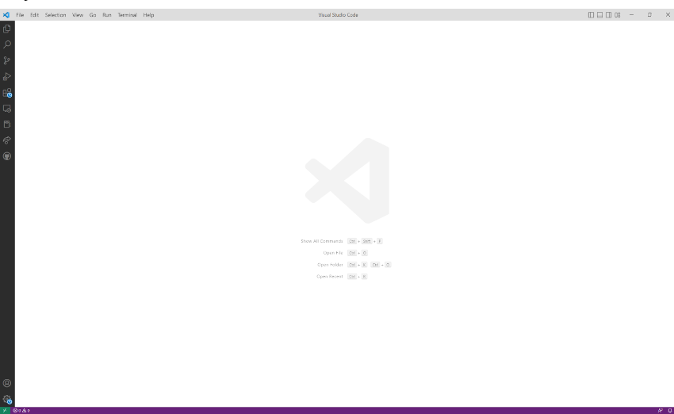
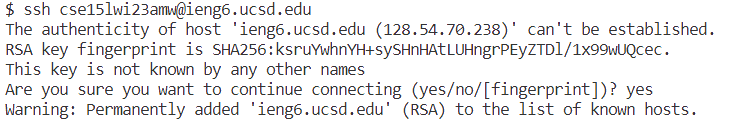
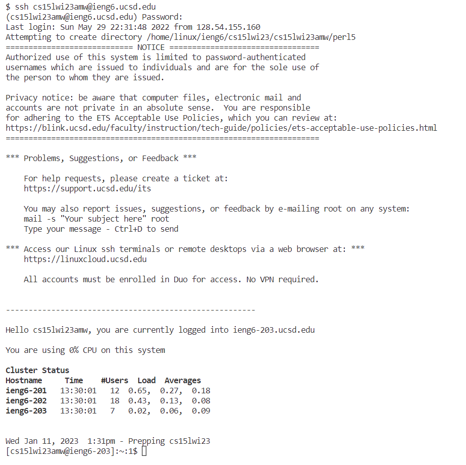
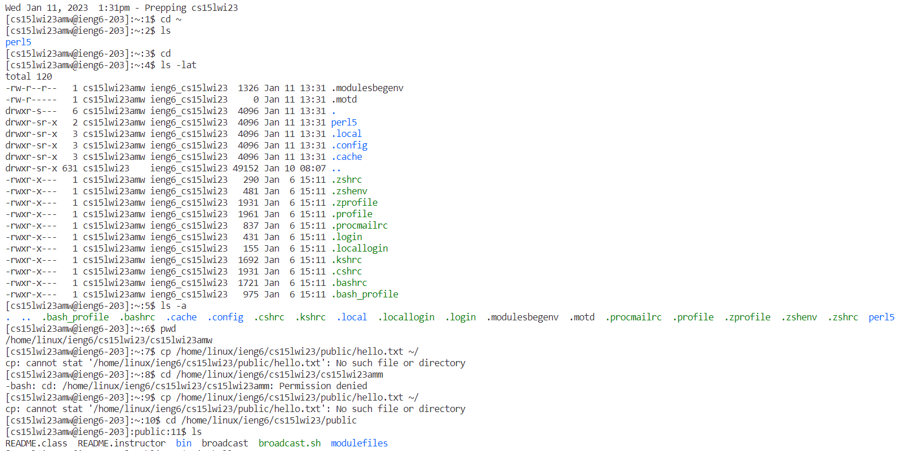

# Installing VSCode

Download VSCode from [Link](https://code.visualstudio.com/) for whatever operating system you have.
Then, when you open it you should get this image.

In VSCode, you can use the terminal and also develop code with the GUI. VSCode also allows you to install extensions like a Vim environment to use Vim while coding.
# Remotely Connecting
If you haven't changed your password yet, reset your password with [Link](https://sdacs.ucsd.edu/~icc/index.php)
If Windows, download git for Windows from [Link](https://gitforwindows.org/)
Open the terminal with Crtl + `
Select Bash terminal.
Use `ssh cs15lwi23abc@ieng6.ucsd.edu` with `abc` with your username instead.
The first time you connect to a server it will ask for authentication for the site.
type `yes` and enter.
Then type your newly changed password.
You should get something like this image

To exit the remote server you can use Crtl + D or `exit` in the terminal.

The `ssh` command stands for secure shell which allow you to access the shell of a remote server or computer and use the command line in that environment. This might be because the other computer has better hardware or very large files that wouldn't fit on a personal computer. 

# Trying Some Commands
Try commands like `cd`, `cp`, `ls`, or `pwd`

Some other commands to try are
* `ls -lat`
* `cd ~`
* `ls -a`

The hyphen gives more options for the output of the command.

You might get something like this

These commands won't work for a windows computer because these commands are built for UNIX and UNIX-like Operating Systems.
You can try these commands in your personal computer as well as when you remotely connect to ieng6.ucsd.edu and see the results.
These commands are very useful for navigating the command line and where you are in the directories. The cp command allows you to copy entire directories very easily by just providing paths. The flags give a lot more information for each of the commands. Like `ls -a` shows all of the `.` files that are hidden normally.
